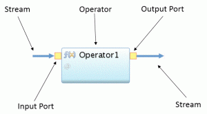
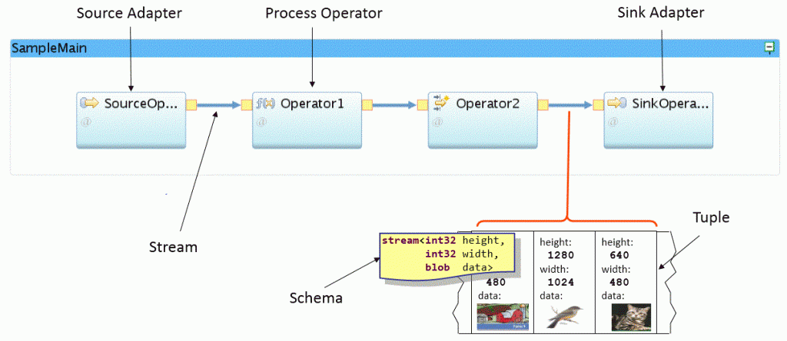
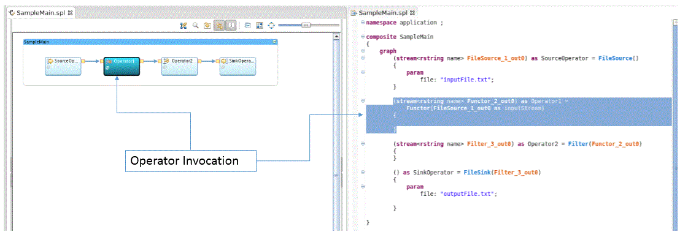
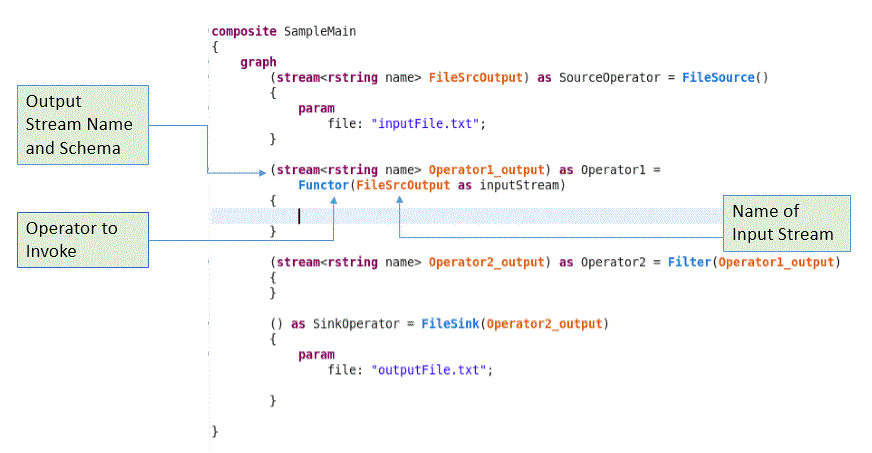

# DESARROLLO PARA IBM STREAMS

## IBM Streams Quick Start Edition

- Gratis, no productiva.
- Sin limites de uso.
- En tu propio entorno RHEL/CentOS.

## Streaming Analytics
- IBM Cloud.
- Plan Lite: 50 horas mensuales gratis.

## Soporte al desarrollo 

- SPL.
- Java, Scala, Python.
- Streams Studio.
- Drag and drop Graphical Editor.
- Visual Studio Code y Atom (Streaming Analytics).
- sc.
- Documentación y ejemplos.

## Estructura de una aplicación Stream

### Bloque básico
- Operador
- Puerto de Entrada
- Puerto de Salida
- Stream



```text
type
bookInfo = tuple<rstring title, rstring isbn, rstring author, rstring publisher, float32 price>;
		
(stream <bookInfo> BookInfoStreamUniques; stream <bookInfo> BookInfoStreamDuplicates) = DeDuplicate(BookInfoStream) {
    param
        timeOut: 120.0;
        key: title, isbn, author, publisher, price;
}
```

### Job

- Tupla
- Esquema



### Operadores

#### SPL Standard Toolkit

##### Relacionales
- Aggregate
- Functor
- Punctor
- Join
- Sort
- etc.

##### Apadatadores
- DirectoryScan
- Export
- Import
- FileSink
- FileSource
- TCPSource
- TCPSink
- UDPSource
- UDPSink
- etc.

##### Utilidades
- Barrier
- Compress
- Decompress
- Custom
- DeDuplicate
- DynamicFilter
- Split
- ThreadedSplit
- Union 
- etc.

#### Specialized Toolkits

- db
- inet
- teda
- financial
- text
- dps
- hbase
- networking
- json
- iot
- geospatial
- rproject
- etc.

#### Open Source Toolkits

- HBase
- Messaging(Kafka, MQTT)
- MongoDB
- Graph DB
- Cassandra
- Slack
- Speech2text
- Regex
- Math
- OpenCV
- etc.

### Main Composite

- Punto de entrada

```text
composite SampleMain
{
}
```

```text
composite SampleMain
{
    graph
        stream ... {
            ...
        }
        stream ... {
            ...
        }
}
```



### SPL aplicación Stream




## Recursos

#### Ejemplos en código

+160

- https://ibmstreams.github.io/samples/
- https://github.com/IBMStreams/samples

#### Tutoriales

- https://ibmstreams.github.io/tutorials/

#### Proyectos Open Source

- https://github.com/IBMStreams
- https://developer.ibm.com/streamsdev/docs/github-projects-overview/

#### Centro de recursos

- https://ibmstreams.github.io

#### IBM Streaming Analytics for IBM Cloud

- https://www.ibm.com/ar-es/cloud/streaming-analytics


### Ejemplo

